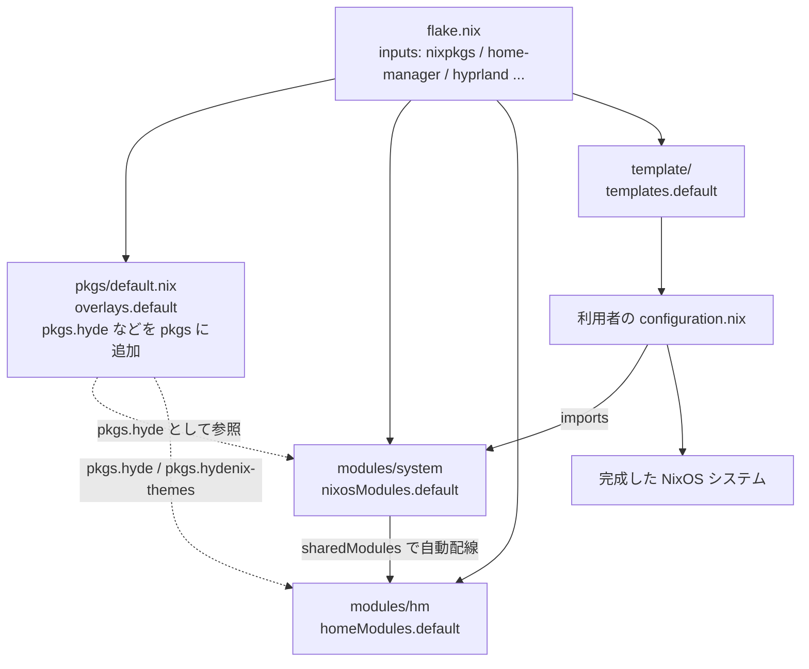
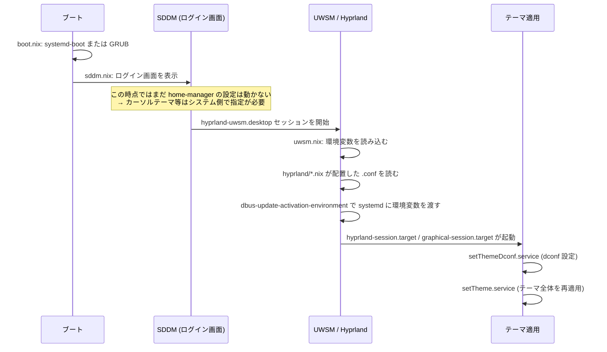
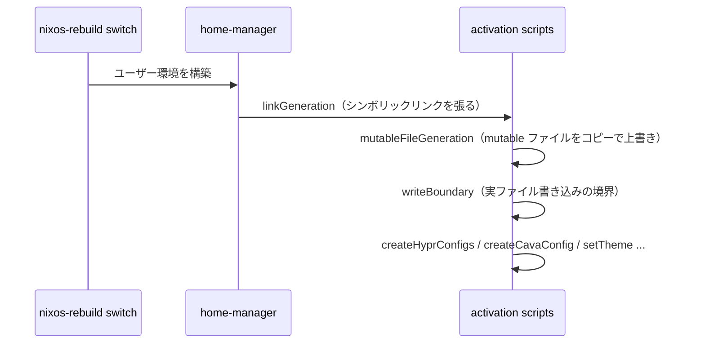

# 01. 全体アーキテクチャ

hydenix のファイルがどうつながっているかを俯瞰します。

## ディレクトリの役割

```
hydenix/
├── flake.nix              ← 【入口】依存の宣言と、公開するモジュール・パッケージの定義
├── flake.lock             ← 依存の正確なバージョン（コミットハッシュ）を固定
│
├── modules/               ← 【本体】利用者が import して使う部分
│   ├── system/            ←   OS 全体の設定（ブート・音声・ネットワーク・Hyprland 本体）
│   └── hm/                ←   ユーザー環境の設定（dotfiles・アプリ設定・テーマ）
│       └── hyprland/      ←     Hyprland の設定群
│           └── utils/mkHyprConfig.nix  ← モジュールを動的生成する関数
│
├── pkgs/                  ← 【パッケージ】独自パッケージの定義 = overlay の中身
│   ├── default.nix        ←   ここで pkgs.hyde などが pkgs に足される
│   ├── hyde/              ←   HyDE 本体の NixOS 向けビルド
│   ├── hydenix-themes/    ←   約 60 種類のテーマ定義
│   ├── hydectl/ hyprquery/ hyde-ipc/ hyde-config/  ← HyDE 付属ツールの Nix 版
│   └── hyde-diff-*/       ←   HyDE 更新の差分確認ツール
│
├── template/              ← 【利用者向け雛形】nix flake new -t で展開される
├── demo/                  ← 【開発用】動作確認用の VM 構成
├── docs/                  ← 【公式ドキュメント】mdbook → GitHub Pages
├── docs-ja/               ← 【この資料】※ ja ブランチにのみ存在
└── scripts/               ← 【保守用】flake.lock とテーマ sha256 の自動更新
```

**重要な区別**: `modules/` と `pkgs/` は「ライブラリとして提供する側」、
`template/` は「利用する側」です。
自分の PC を構築するときに編集するのは `template/` からコピーしたファイルであり、
`modules/` は基本的に読むだけになります。

> [!NOTE]
> 本家（richen604）では `hydenix/modules/` と `hydenix/sources/` でしたが、
> このフォークでは 1 階層浅くなり、`sources/` は `pkgs/` に改名されています。

## 依存関係の流れ



> [!IMPORTANT]
> **`nixosModules.default` が home-manager 本体と `homeModules.default` を自動で読み込みます。**
> 本家では利用者が `home-manager.sharedModules` を自分で書く必要がありましたが、
> このフォークでは `inputs.hydenix.nixosModules.default` を imports に足すだけで済みます。

## 起動から画面が出るまで

コードを読むときは、この時系列を頭に置くと理解しやすくなります。



`nixos-rebuild switch` を実行したときの流れは別です。



> [!WARNING]
> 最後の 3 つは `entryAfter ["mutableGeneration"]` と書かれていますが、
> **その名前のエントリは存在しません**（正しくは `mutableFileGeneration`）。
> そのため上の図の順序は保証されていません。詳細は [08](./08-improvements.md)。

## オプションの名前空間

hydenix は 2 つの名前空間を持ちます。

| 名前空間 | 定義場所 | 書く場所 | 例 |
|---|---|---|---|
| `hydenix.*` | `modules/system/` | `configuration.nix` | `hydenix.hostname = "mypc";` |
| `hydenix.hm.*` | `modules/hm/` | `modules/hm/default.nix` | `hydenix.hm.theme.active = "Tokyo Night";` |

どちらも「親を有効にすれば子も有効になる」設計です。

```nix
# modules/system/boot.nix より
enable = lib.mkOption {
  type = lib.types.bool;
  default = config.hydenix.enable;   # ← 親に追従する
  description = "Enable boot module";
};
```

このおかげで、利用者は `hydenix.enable = true;` と書くだけで全部が有効になり、
不要なものだけ `hydenix.gaming.enable = false;` のように個別に切れます。

> [!CAUTION]
> **例外が 3 つあります。** `nix.nix` / `sddm.nix` / `system.nix` の `enable` は
> 既定値が `config.hydenix.enable` ではなく `true` で固定されています。
> つまり `hydenix.enable = false;` にしても SDDM や Hyprland は有効なままです。
> 本家から続く仕様で、意図的かどうかは不明です。

## どこから読み始めるか

目的別のおすすめ順路です。

- **とりあえず全体を掴みたい**
  `flake.nix` → `template/configuration.nix` → `modules/system/default.nix` → `modules/hm/default.nix`
- **設定ファイルがどこから来るのか知りたい**
  `pkgs/hyde/default.nix` → `modules/hm/hyde.nix` → [04](./04-mutable-files.md)
- **テーマの仕組みを知りたい**
  `pkgs/hydenix-themes/utils/mkTheme.nix` → `modules/hm/theme.nix` → [05](./05-theme-system.md)
- **Hyprland の設定を変えたい**
  `modules/hm/hyprland/options.nix` → `modules/hm/hyprland/utils/mkHyprConfig.nix` → [06](./06-hyprland-modules.md)
- **上流に PR を送りたい**
  [08](./08-improvements.md)（何を直すか） → [09](./09-fork-workflow.md)（どう送るか）
