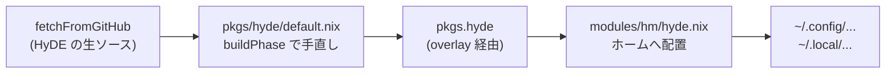

# 03. HyDE を NixOS 向けにパッケージ化する

対象ファイル: [`pkgs/hyde/default.nix`](../pkgs/hyde/default.nix)

## 何が問題なのか

HyDE はもともと Arch Linux 用の設定集なので、そのまま NixOS に持ってくると主に次の 5 つの理由で動きません。

| 問題 | 具体例 |
|-----|-------|
| プロセス名が違う | NixOS はラッパー経由で起動するので、実プロセス名が `.waybar-wrapped` になる |
| 設定がシンボリックリンク | `find` がリンクをたどらず、設定ファイルを見つけられない |
| バイナリの入手方法が違う | Arch は `pacman` 前提。NixOS では Nix パッケージを使う |
| Python 環境が存在しない | 実行時に `uv` で作る venv が前提だが、NixOS では誰もそれを作らない |
| アーカイブが未展開 | フォント・アイコン・GRUB テーマが `.tar.gz` のまま同梱されている |

`buildPhase` は、これらを 1 つずつ潰していく処理です。

## buildPhase がやっていること

### (1) 不要なファイルの削除

```bash
rm -rf Source/assets                        # 素材フォルダ（実行時に不要・容量が大きい）
rm -rf Configs/.local/lib/hyde/resetxdgportal.sh
rm -rf Configs/.local/bin/hydectl
rm -rf Configs/.local/bin/hyde-ipc
rm -rf Configs/.local/lib/hyde/hyde-config
rm -rf Configs/.local/lib/hyde/hyq
rm -rf Configs/.local/bin/hyq
```

`hydectl` / `hyq` / `hyde-ipc` / `hyde-config` は、HyDE に同梱されているものではなく**Nix パッケージとして別途ビルドしたバイナリ**を使います（`pkgs/` 以下にそれぞれ定義があります）。そのため同梱版を削除して、確実に Nix 版が使われるようにしています。

`resetxdgportal.sh` は、あとで [`modules/hm/hyde.nix`](../modules/hm/hyde.nix) が空のスクリプトに差し替えます。NixOS では XDG ポータルを systemd が管理するので、 HyDE 側の再起動処理は邪魔だからです。

### (2) プロセス名の置換

```bash
find . -type f -print0 | xargs -0 sed -i 's/killall waybar/killall .waybar-wrapped/g'
```

NixOS では、多くのプログラムが「環境変数を設定してから本体を呼ぶ」ラッパースクリプト経由で起動されます。このとき実プロセス名が `.waybar-wrapped` のように先頭ドット付きになります。

HyDE のスクリプトは `killall waybar` でバーを再起動しようとしますが、 NixOS ではその名前のプロセスが存在しないため失敗します。そこで置換して名前を合わせています。対象は waybar / dunst / kitty / swaync の 4 つです。

swaync だけは `killall` ではなく `pgrep -x swaync` で生存確認をしており、置換対象もそちらです。ここが漏れていると waybar の通知モジュールが常に「swaync は起動していない」と判断し、クリックしても通知センターが開きません（[santamn/hydenix#9](https://github.com/santamn/hydenix/pull/9)）。

### (3) find のシンボリックリンク対応

```bash
find . -type f -executable -print0 | xargs -0 sed -i 's/find "/find -L "/g'
find . -type f -name "*.sh" -print0 | xargs -0 sed -i 's/find "/find -L "/g'
```

home-manager は設定ファイルを Nix ストアへのシンボリックリンクとして配置します。 `find` は既定でリンクをたどらないため、HyDE のスクリプトがテーマや壁紙を見つけられなくなります。`-L` オプションを付けてリンク先を追跡させます。

> [!NOTE]
> 本家は実行ファイルだけを対象にしていましたが、このフォークでは `*.sh` も対象に追加されています（2 行目）。

### (4) 個別の不具合対応（フォークでは無効化）

```bash
# remove lines 187-190 from Configs/.local/lib/hyde/theme.switch.sh
# fixes gtk4 themes
# sed -i '187,190d' Configs/.local/lib/hyde/theme.switch.sh

# remove pkill command from rofilaunch.sh
# sed -i '2d' Configs/.local/lib/hyde/rofilaunch.sh
```

本家では行番号を決め打ちして `sed` で行を削除していましたが、 HyDE 本体を更新すると意図しない行を消してしまうため、このフォークでは両方ともコメントアウトされています。

復活させる必要が出た場合は、必ず差分を確認してから行番号を取り直してください。

```bash
nix run .#hyde-diff-upstream    # 固定中の HyDE と上流 master の差分
nix run .#hyde-diff-home        # 固定中の HyDE と自分のホーム構成の差分
```

### (5) Python インタプリタの差し替え

```bash
find . -type f -print0 | xargs -0 sed -i \
  's|${XDG_STATE_HOME:-$HOME/.local/state}/hyde/python_env/bin/python|${hydePython}/bin/python|g'
```

HyDE の Python スクリプトは、実行時に `uv` が `$XDG_STATE_HOME/hyde/python_env` へ作る venv を前提にしています。NixOS ではその venv を作る処理が動かないので、`hyde-shell`（`run_command`）・`gpuinfo.sh` の AMD 分岐・`gamelauncher.sh` が存在しないパスを `exec` して何も出力せずに終了していました。waybar のモジュールが空になる、という形で表面化します。

そこで `hydePython` 引数（既定は `inotify-simple` / `loguru` / `pulsectl` / `pygobject3` / `pywayland` / `requests` / `xdg-base-dirs` と `pyamdgpuinfo` を入れた `python3`）を用意し、venv のパスをすべてこれに置換しています。ライブラリを足したり減らしたりしたい場合は、この引数を `overrideAttrs` ではなく `callPackage` の引数として差し替えてください（[santamn/hydenix#8](https://github.com/santamn/hydenix/pull/8)）。

### (6) アーカイブの展開

```bash
mkdir -p $out/share/fonts/truetype
for fontarchive in ./Source/arcs/Font_*.tar.gz; do ... done
```

フォント・VS Code 拡張・GRUB テーマ・アイコン・GTK テーマを `$out/share/` 以下に展開します。これにより、他のモジュールから次のように参照できるようになります。

```nix
# modules/system/boot.nix
theme = pkgs.hyde + "/share/grub/themes/Retroboot";

# modules/hm/editors.nix
".vscode/extensions/prasanthrangan.wallbash".source =
  "${pkgs.hyde}/share/vscode/extensions/prasanthrangan.wallbash";
```

### (7) installPhase と postInstall

```bash
mkdir -p $out
cp -r . $out
```

手直し済みのソースツリー全体を `$out` にコピーします。これにより `${pkgs.hyde}/Configs/...` という形で、 HyDE の元のディレクトリ構造をそのまま参照できるようになります。

さらに `postInstall` で `hyde-shell` の 1 行目（シバン）の直後に `export PATH=...` を挿し込み、`hydePython` を `PATH` に載せています。

ここで `wrapProgram` を使ってはいけません。`hyde-shell` は実行されるだけでなく、`hyprsunset.sh` / `hyprlock.sh` / `animations.sh` / `workflows.sh` / `wallpaper.mpvpaper.sh` から `source "$(which hyde-shell)"` の形で読み込まれます。`wrapProgram` が生成するラッパーは最後に `exec` で本体へ処理を渡すため、`source` した側のプロセスがそこで置き換わり、これらのスクリプトは 1 行目で終了します。スクリプト自身に環境を埋め込む形にしているのはこのためです（[santamn/hydenix#7](https://github.com/santamn/hydenix/pull/7)）。

## 完成したパッケージの構造

```
/nix/store/xxxx-hyde/
├── Configs/                    ← HyDE の元のディレクトリ構造そのまま
│   ├── .config/hypr/...        ←   各モジュールが source / readFile で参照する
│   ├── .local/lib/hyde/...     ←   スクリプト群
│   └── ...
└── share/                      ← buildPhase で展開したもの
    ├── fonts/truetype/
    ├── vscode/extensions/
    ├── grub/themes/
    ├── icons/
    └── themes/
```

## 参照される流れ



## HyDE を更新するときの手順

`pkgs/hyde/default.nix` の `rev` と `hash` を書き換えるのが基本ですが、 HyDE はスクリプトの塊なので、更新すると壊れやすい部分があります。

1. `nix run .#hyde-diff-upstream` で上流の変更を確認する
2. `rev` / `hash` を更新する
3. `nix run .#hyde-diff-home` で、自分のホーム構成に配置されないファイルが増えていないか確認する（新しい設定ファイルが追加されていたらモジュール側の追従が要る）
4. VM (`nix run .`) で動作確認する

> [!WARNING]
> ピン留め中の `v26.7.4` より後の HyDE には `Source/arcs/Code_Wallbash.vsix` と `Font_*.tar.gz` が存在しません。(6) の `unzip` はここで失敗し、フォントのループは `if [ -f ... ]` に守られているためエラーにならず**フォントが 0 個のパッケージが黙って出来上がります**。rev を上げるときは先にこの 2 つの入手先を決めてください。詳しくは [08-improvements.md](./08-improvements.md) の A-0 を参照。

## 覚えておくとよいこと

- **HyDE の設定ファイルの実体は必ず `pkgs.hyde` の中にある**：`~/.config/hypr/hyprlock.conf` を見ても、実体は `/nix/store/...` へのリンクになっている
- **リンク先を編集しても意味がない**
  - 読み取り専用なので編集できない。設定を変えたいときは Nix 側のオプションを使う → [06](./06-hyprland-modules.md)
  - `mutable` 指定のファイルは例外でコピーを作っているので編集できる → [04](./04-mutable-files.md)
