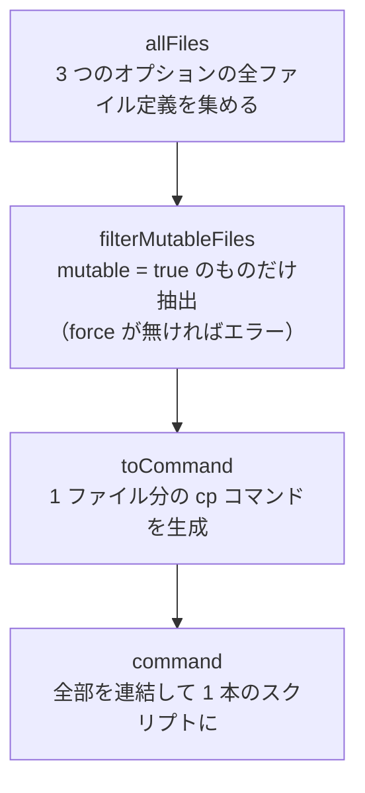

# 04. `mutable` オプション — hydenix の核心

対象ファイル: [`modules/hm/mutable.nix`](../modules/hm/mutable.nix)

hydenix でいちばん理解しづらく、かつ**いちばん重要**な仕組みです。

## 前提: home-manager の通常の動き

home-manager で設定ファイルを配置すると、こうなります。

```nix
".config/hypr/hyprlock.conf".source = "${pkgs.hyde}/Configs/.config/hypr/hyprlock.conf";
```

```
~/.config/hypr/hyprlock.conf
  → /nix/store/xxxx-home-manager-files/.config/hypr/hyprlock.conf
    → /nix/store/yyyy-hyde/Configs/.config/hypr/hyprlock.conf
```

**シンボリックリンク**であり、リンク先の Nix ストアは**読み取り専用**です。
これは Nix の設計思想そのもので、次の利点があります。

- 設定が完全に再現可能（同じ入力なら必ず同じ結果）
- 変更点が Nix のコードに集約される（ホームディレクトリが真実を持たない）
- ロールバックが確実にできる

## 問題: HyDE は設定ファイルを書き換える

ところが HyDE は、テーマを切り替えるときに**シェルスクリプトが設定ファイルを書き換える**
という前提で作られています。

```
theme.switch.sh を実行
  → 壁紙の画像から色を抽出 (wallbash)
    → ~/.config/waybar/theme.css を書き換え
    → ~/.config/kitty/theme.conf を書き換え
    → ~/.config/dunst/dunstrc を書き換え
    → ... (十数個のファイル)
```

読み取り専用のリンクに書き込もうとするので、**Permission denied で失敗します**。

これが hydenix が解決しなければならない中心的な矛盾です。

## 解決策: `mutable` オプション

`mutable.nix` は home-manager の `home.file` / `xdg.configFile` / `xdg.dataFile` に
`mutable` というオプションを**後付け**します。

```nix
".config/kitty/theme.conf" = {
  source = "${pkgs.hyde}/Configs/.config/kitty/theme.conf";
  force = true;      # mutable を使うときは必須
  mutable = true;    # ← これ
};
```

`mutable = true` を付けると、**リンクではなくコピー**として配置され、書き込み権限が付きます。

```
【通常】 ~/.config/hypr/hyprlock.conf → /nix/store/... （リンク・読み取り専用）
【mutable】~/.config/kitty/theme.conf   （実ファイルのコピー・書き込み可能）
```

## 仕組み（コードの読み方）

`mutable.nix` は前半 (`options`) と後半 (`config`) に分かれています。

### 前半: オプションを生やす

```nix
fileOptionAttrPaths = [
  ["home" "file"]
  ["xdg" "configFile"]
  ["xdg" "dataFile"]
];
```

3 つの属性パスを「リストのリスト」で表現し、それぞれに対して
`mutable` サブオプションを持つ型を定義しています。

```nix
mergeAttrsList (
  map (attrPath: lib.setAttrByPath attrPath (lib.mkOption {type = fileAttrsType;}))
      fileOptionAttrPaths
)
```

- `lib.setAttrByPath ["home" "file"] X` → `{home.file = X;}` を作る
- それを 3 つ分作って `mergeAttrsList` で 1 つに統合する

同じことを 3 回書く代わりにループで生成しているだけです。
これが成立するのは、**モジュールシステムが既存のオプション定義とマージしてくれる**からです。
`home.file` の他の性質（`source` や `force` など）は home-manager 本体が定義したものが
そのまま残り、そこに `mutable` だけが足されます。

### 後半: コピーする activation script を生成

```nix
home.activation.mutableFileGeneration = ... lib.hm.dag.entryAfter ["linkGeneration"] command;
```

処理の流れは 4 段階です。



生成されるコマンドの核心部分:

```bash
cp --remove-destination --no-preserve=mode <source> <target>
```

| オプション | 意味 |
|---|---|
| `--remove-destination` | 既にあるシンボリックリンクを消してから書く（これが無いとリンク先に書こうとして失敗する） |
| `--no-preserve=mode` | Nix ストアの読み取り専用パーミッションを**引き継がない**（これが本質） |

そのあと、コピーしたものがスクリプトなら実行権限を付け直します。
`file -b` でファイル種別を判定し、`executable` か `script` を含むか、
`.sh` で終わるものに `chmod u+wx` します。
HyDE は `~/.local/lib/hyde/*.sh` を実行するので、これが無いと動きません。

### 実行順序

```nix
lib.hm.dag.entryAfter ["linkGeneration"] command
```

home-manager の activation は DAG（依存グラフ）で順序が決まります。
`linkGeneration`（シンボリックリンクを張る処理）の**後**に実行することで、
「まずリンクを張る → mutable なものだけコピーで上書きする」という順序を保証しています。

> [!WARNING]
> **このエントリ名 `mutableFileGeneration` を、他の 3 モジュールが
> `mutableGeneration` と誤って参照しています。** 詳細は [08](./08-improvements.md)。

## `force = true` が必須な理由

```nix
lib.assertMsg file.force
  "if you specify `mutable` to `true` on a file, you must also set `force` to `true`"
```

`force = false` のままだと、home-manager は既存ファイルがあるときにリンク作成を中断し、
「ファイルが既に存在する」というエラーを出します。
mutable ファイルは前回の rebuild でコピーされた実ファイルが必ず存在するため、
`force = true` で「既存を上書きしてよい」と明示する必要があります。

## トレードオフ

| | 通常（リンク） | mutable（コピー） |
|---|---|---|
| 書き込み | 不可 | 可能 |
| 再現性 | 完全 | 実行時に変化しうる |
| 設定から削除したとき | 自動で消える | **消えずに残る** |
| ディスク使用量 | 少ない（共有） | 多い（実体を持つ） |
| ロールバック | 確実 | 内容は戻らない |

**「設定から削除しても消えない」が最大の落とし穴です。**
mutable ファイルを使わなくなった場合や、古い設定が悪さをしている場合は、
手動で削除する必要があります。

```bash
# 例: テーマ関連の状態をリセットしたい場合
rm -rf ~/.config/hyde ~/.local/share/hyde ~/.cache/hyde
# その後 nixos-rebuild switch で再配置される
```

## どのファイルが mutable なのか

コード中で `mutable = true;` を検索すると分かります。

```bash
grep -rn "mutable = true" modules/hm/
```

おおよそ次の性質を持つファイルです。

- **wallbash が書き込む配色ファイル** — `theme.css` / `theme.conf` / `colors.conf` など
- **テーマ切り替えで書き換わる設定** — `dunstrc` / `kdeglobals` / `gtk-3.0/settings.ini`
- **アプリが自分で書き換える設定** — `hyde/config.toml` / VS Code の `settings.json`
- **HyDE のスクリプト・データ本体** — `~/.local/share/hyde` / `~/.local/lib/hyde`
- **Hyprland の各種 `.conf`** — `mkHyprConfig` が生成するもの全部（後述）

> [!IMPORTANT]
> **フォークでの変更点**: `mkHyprConfig` が生成する設定は**すべて `mutable = true`** です。
> 本家では `monitors.conf` だけが mutable で、`keybindings.conf` などはリンクでした。
>
> つまり `hypridle.conf` / `keybindings.conf` / `windowrules.conf` / `nvidia.conf` /
> `hyprsunset.conf` も、いまはコピーとして配置されます。
> HyDE 側のツールがこれらを書き換えられる利点がある一方、
> **モジュールを無効化してもファイルがホームに残り続ける**という副作用があります。

## 自分の設定で mutable なファイルを上書きしたいとき

利用者側で `home.file` に同じパスを書いても、**mutable のコピーに後から上書きされて効きません**。
`mutableFileGeneration` が `linkGeneration` の後に走るためです。

対処は次のいずれかです。

1. 自分の側でも `mutable = true;` と `force = true;` を併記する
2. 参照元（例: waybar の `includes.json`）を書き換えて、独自パスを指させる

具体例（waybar の clock モジュールを差し替えたい場合）:

```nix
# 効かない
home.file.".config/waybar/modules/clock.jsonc" = {text = ...; force = true;};

# 効く
home.file.".config/waybar/modules/clock.jsonc" = {
  text = ...;
  force = true;
  mutable = true;   # ← これが要る
};
```

## 自分の設定で使うときの指針

1. **まずは mutable なしで試す。** 書き込みエラーが出てから初めて検討する。
2. **使うなら `force = true` を必ずセットで書く**（書かないとビルドが止まる）。
3. **消したくなったら手で消す**必要があることを覚えておく。
