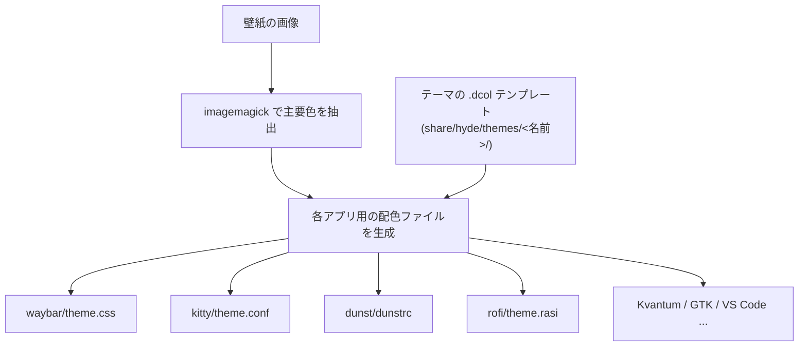
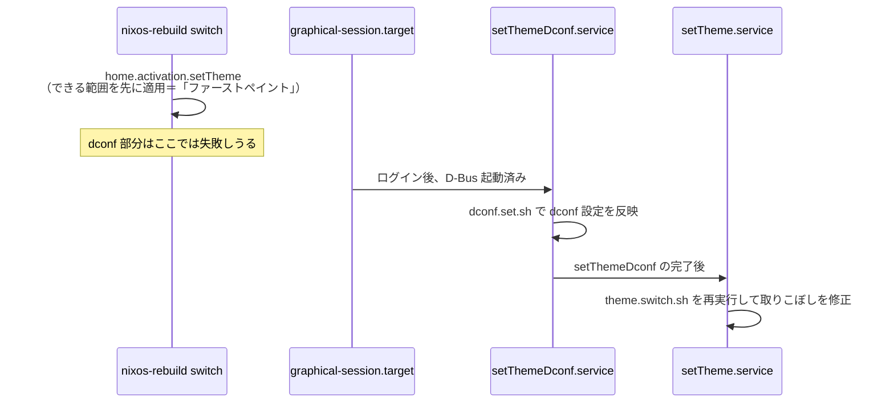

# 05. テーマシステムと wallbash

対象ファイル: [`modules/hm/theme.nix`](../modules/hm/theme.nix) / [`pkgs/hydenix-themes/`](../pkgs/hydenix-themes/)

## 全体像

hydenix のテーマは2層に分かれて管理されています。

| 層 | 何をするか | 担当 |
|----|----------|-----|
| **テーマ** | 壁紙・配色・アイコン・フォントのセット | `pkgs/hydenix-themes/` |
| **wallbash** | 現在の壁紙から色を抽出し各アプリの配色を自動生成 | HyDE 本体のスクリプト |

## パート1: テーマのパッケージ化

### テーマの定義

各テーマファイルは、すべて同じ形をした小さなデータファイルです。

```nix
# pkgs/hydenix-themes/Decay-Green.nix
{pkgs, mkTheme}:
mkTheme rec {
  name = "Decay Green";
  src = pkgs.fetchFromGitHub {
    owner = "HyDE-Project";
    repo = "hyde-themes";
    rev = "b5daf8e2717cdac23fcd3a7909869130b2877049";   # コミットで固定
    inherit name;
    sha256 = "sha256-Vg9WsRPrkpkQMtOT+8rjf7CKiCvTQ12XZYX6hfUU0h0=";
  };
  meta = {description = "..."; homepage = "...";};
}
```

### mkTheme.nix によるビルド

[`utils/mkTheme.nix`](../pkgs/hydenix-themes/utils/mkTheme.nix) が実際のビルド処理を担当し、次のレイアウトを持つパッケージを作ります。

```
$out/share/
├── hyde/themes/<テーマ名>/   ← HyDE が読む設定一式（wallbash の色定義など）
├── themes/                   ← GTK テーマ
├── icons/                    ← アイコン・カーソルテーマ
└── fonts/                    ← フォント
```

テーマによって同梱されるものが違うため、`for ... if [ -f ... ]` であるものだけ入れるようにしています。

`dontPatchELF` / `dontRewriteSymlinks` / `dontDropIconThemeCache` は、Nix が実行ファイル向けに行う後処理を無効化する指定です。テーマは素材の集まりなので、これらの処理はむしろ壊す原因になります。

### カタログ

[`pkgs/hydenix-themes/default.nix`](../pkgs/hydenix-themes/default.nix) が「表示名 → パッケージ」の対応表を作り、`pkgs.hydenix-themes` として公開します。

```nix
{
  "BlueSky" = callTheme ./BlueSky.nix;
  "Rosé Pine" = callTheme ./Rose-Pine.nix;   # ← キーとファイル名は一致しない
  "Mac OS" = callTheme ./Mac-OS.nix;
  "Catppuccin-Macchiato" = callTheme ./Catppuccin-Macchiato.nix;  # ← これだけハイフン
  ...
}
```

> [!IMPORTANT]
> **利用者が書くテーマ名は、このファイルのキーと完全に一致させる必要があります。**
> ハイフンだったり空白だったり、`Rosé` のようにアクセント付き文字だったりと不規則なので、設定する前に必ず `pkgs/hydenix-themes/default.nix` を確認してください。

### theme.nix によるインストール

```nix
findThemeByName = themeName: pkgs.hydenix-themes.${themeName} or null;
availableThemes = lib.filter (themeName: findThemeByName themeName != null) cfg.themes;
```

`or null` により、**存在しないテーマ名を書いてもビルドは失敗せず、黙って無視されます**。[`demo/home.nix`](../demo/home.nix) の末尾にある `"Some Theme"` は、この挙動を検証するためのテスト用エントリです。

親切なようですが、タイプミスに気づけないという副作用もあります。テーマが適用されないときは、まず名前のスペルを疑ってください。

配置先は `~/.config/hyde/themes/<テーマ名>` で、`mutable = true` が付いています（wallbash がこの中に生成物を書き込むため）。

## パート 2: wallbash

wallbash は HyDE の目玉機能で、次のように動きます。



生成先のファイルは書き込み可能でなければならないので、すべて `mutable = true` が指定されています → [04](./04-mutable-files.md)

hydenix 側は基本的にHyDE のスクリプトが動く環境を整えるだけで、色を作る処理そのものには関与していません。

## パート 3: テーマ適用のタイミング問題

`theme.nix` で最も分かりにくいのがここです。

### なぜ 3 か所で適用しているのか

テーマ適用スクリプト `theme.switch.sh` は、内部で dconf（GNOME 系の設定ストア）を使います。dconf は D-Bus が必要で、D-Bus はグラフィカルセッションと一緒に起動します。一方 `nixos-rebuild switch` の activation script は、セッションが始まる前（あるいはログイン中の別コンテキスト）で走ります。つまり、初回の rebuild では dconf を使う部分が必ず失敗するのです。

そこで hydenix は3段構えにしています。



| 実行者 | タイミング | 目的 |
|-------|----------|------|
| `home.activation.setTheme` | rebuild 時 | 壁紙や設定ファイルなど、セッション不要な部分を先に適用 |
| `setThemeDconf.service` | ログイン後 | dconf の設定を反映 |
| `setTheme.service` | dconf の後 | テーマ全体を再適用して整合性を取る |

コード中のコメントに「これは Web で言うファーストペイントに近い」とあるのはこの意味です。

### PATH を明示している理由

```nix
export PATH="${lib.makeBinPath (with pkgs; [awww killall hyprland dunst ...])}:$HOME/.local/bin:$PATH"
```

activation script は最小限の環境で動くため、`awww` や `imagemagick` などが PATH にありません。`lib.makeBinPath` でパッケージのリストから PATH 文字列を組み立てて明示的に通しています。

systemd サービス側も同様に `Path = [...];` で指定しています。

> [!NOTE]
> 本家ではここが `swww` でした。フォークでは壁紙デーモンが `awww` に変わっています。

### ログの場所

うまくいかないときは、ここを見てください。

```bash
# activation script のログ
cat ~/.local/state/hyde/theme-switch.log

# systemd サービスのログ
journalctl --user -u setTheme.service
journalctl --user -u setThemeDconf.service
```

## テーマを変更する方法

```nix
# modules/hm/default.nix（利用者側）
hydenix.hm.theme = {
  active = "Tokyo Night";        # 起動時に適用されるテーマ
  themes = [                     # インストールするテーマ（active はここに含める）
    "Tokyo Night"
    "Catppuccin Mocha"
  ];
};
```

> [!TIP]
> `themes` に書いた分だけビルド時間とディスク容量を消費します。`demo/home.nix` は検証目的で全部書いていますが、実利用では 2〜3 個に絞るのが現実的です。

実行中に切り替えたい場合は、HyDE 側の機能（waybar のテーマボタン、`hyde-shell` など）が使えます。ただしその変更は Nix の管理外なので、次の rebuild で `active` の値に戻ります。

## コード中に残っている TODO

`theme.nix` には次の TODO が残っています。

> theme.set.sh / dconf.set.sh がやっていることを Nix 側で再現し、gtk/qt などの設定を home.file で直接書き込むようにすればよい

もしこれが実現すれば、activation script も systemd サービスも mutable ファイルも減らせます。現状は「HyDE のスクリプトをそのまま動かす」方針を取っており、HyDE 本体の更新に追従しやすい代わりに、仕組みが複雑になっています。

> [!WARNING]
> **この TODO が名指ししている 2 本のスクリプトは、現在の HyDE には存在しません。**
> 上流のリファクタリングで `theme.set.sh` は `color.set.sh` に、`dconf.set.sh` は `color/dconf.sh` になりました。
> `theme.nix` の `setThemeDconf.service` は改名前のパスを指したままなので、このサービスは起動に失敗し続けています（実害と対処は [08-improvements.md](./08-improvements.md) の B-8）。
